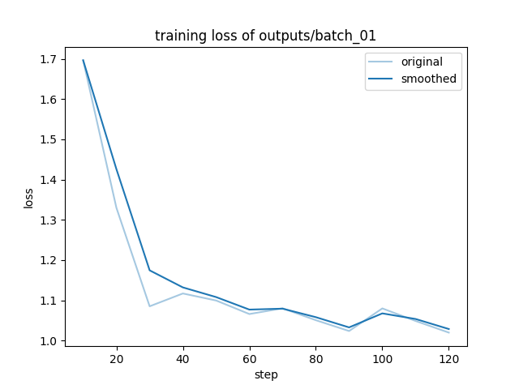
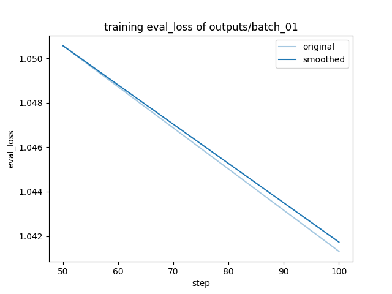
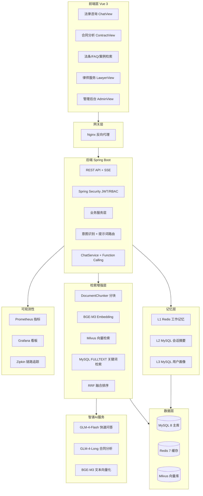

<div align="center">

# ⚖ 律法通 LvFaTong

**AI 驱动的智能法律咨询平台**

面向法律咨询场景提供 AI 问答、知识检索、合同风险分析、案例检索、律师服务与会话记忆能力

[](LICENSE)
[](https://adoptium.net/)
[](https://spring.io/projects/spring-boot)
[](https://vuejs.org/)
[](https://www.docker.com/)
[](https://github.com/qie-ye/lvfatong/actions)

</div>

---

项目以"**法律专业性 + 工程可落地**"为目标：

- 在 AI 层实现了 `RAG + Function Calling + 多轮记忆` 的完整闭环
- 在业务层覆盖了法律咨询的高频场景（问答、法条、FAQ、合同、案例、律师）
- 在工程层具备了 `安全鉴权 + 可观测性 + 容器化部署 + CI` 的生产化能力

## ✨ 项目亮点

- 🤖 **智能法律问答**：RAG 检索增强 + SSE 流式响应 + 意图识别路由
- 📄 **合同分析**：PDF/Word 解析 → 条款抽取 → 规则引擎风险识别 → AI 增强报告
- 🔍 **多知识源融合**：MySQL 全文检索 + Milvus 向量检索 + RRF 融合排序
- 🔧 **Function Calling**：复杂问题自动调用法条/案例/FAQ/律师/合同工具链
- 🧠 **长期记忆**：Redis(上下文) + MySQL(摘要) + MySQL(画像) 三层记忆
- 🏢 **企业级能力**：JWT+RBAC、审计日志、全局异常处理、Prometheus/Grafana/Zipkin 可观测

---

## 🚀 快速演示

<div align="center">

| 训练 Loss 曲线 | 验证 Eval Loss 曲线 |
|:---:|:---:|
|  |  |

</div>

> 📈 基于 Qwen2-7B 的 LoRA 微调 loss 曲线，完整微调流程见 [finetune/](finetune/) 目录

---

## 技术栈

### 1) 后端基础技术栈

| 技术 | 版本 | 在项目中的作用 |
|---|---|---|
| `Java` | 17 | 业务核心开发语言，使用 LTS 版本保证稳定性 |
| `Spring Boot` | 3.2.5 | 单体应用框架，组织 API、业务、数据与安全模块 |
| `Spring Web` | - | 提供 REST API、SSE 流式接口 |
| `Spring Security` | - | 登录鉴权、JWT 校验、RBAC 权限控制 |
| `Spring Data JPA` | - | 业务数据持久化与 Repository 抽象 |
| `Hibernate` | - | ORM 映射与 SQL 执行 |
| `Spring Data Redis` | - | 会话上下文缓存、短期记忆存储 |
| `Spring Validation` | - | 请求参数校验与输入约束 |
| `Springdoc OpenAPI` | 2.3.0 | 自动生成在线 API 文档（Swagger） |
| `Resilience4j` | 2.2.0 | AI 外部调用熔断与容错降级 |

### 2) AI 与检索技术栈

| 技术 | 在项目中的作用 | 已落地能力 |
|---|---|---|
| 智谱 GLM 系列模型 | 对话生成、意图识别、总结与增强推理 | 法律问答、合同分析增强、会话摘要 |
| `BGE-M3 Embedding` | 文本向量化 | 法律文本向量检索 |
| `Milvus 2.4.x` | 向量数据库 | 语义检索、相似内容召回 |
| MySQL `FULLTEXT` | 关键词检索引擎 | 法条/FAQ/案例关键词检索 |
| 混合检索 + `RRF` | 融合关键词与向量结果 | 提升召回率与结果稳定性 |
| Function Calling | 大模型工具调用机制 | 法条查询、案例查询、FAQ查询、律师查询、合同分析联动 |

### 3) 数据存储与中间件

| 技术 | 作用 |
|---|---|
| `MySQL 8` | 业务主库（用户、会话、消息、合同、案例、FAQ、律师等） |
| `Redis 7` | 会话缓存、短期记忆、性能加速 |
| `Flyway` | 数据库版本迁移与初始化脚本管理 |

### 4) 前端技术栈

| 技术 | 作用 |
|---|---|
| `Vue 3 + TypeScript` | 构建类型安全的前端应用 |
| `Vite 5` | 前端快速构建与开发热更新 |
| `Vue Router 4` | 页面路由与权限守卫 |
| `Pinia` | 认证、聊天、合同、通知等状态管理 |
| `Element Plus` | 业务管理风格 UI 组件 |
| `Axios` | API 请求封装 |
| `ECharts` | 图表可视化（分析与统计展示） |

### 5) 运维、观测与交付

| 技术 | 作用 |
|---|---|
| `Docker / Docker Compose` | 本地与生产容器化部署 |
| `Nginx` | 反向代理、静态资源托管、SSE 代理优化 |
| `Micrometer + Prometheus` | 指标采集与监控 |
| `Grafana` | 监控可视化看板 |
| `OpenTelemetry + Zipkin` | 分布式链路追踪 |
| `logstash-logback-encoder` | 结构化 JSON 日志 |
| `GitHub Actions` | 自动化测试、构建与镜像发布 |

---

## 功能展示（已实现）

### 1) 智能法律问答

- 支持普通对话与法律场景问答
- 支持 `SSE` 流式返回，提升交互体验
- 通过意图识别路由不同提示词模板与处理策略
- 支持复杂问题的 Function Calling 工具链调用

### 2) 法律知识检索

- 法条检索：支持关键词与语义混合召回
- FAQ 检索：支持分类、搜索、匹配
- 案例检索：支持列表与详情查看

### 3) 合同分析

- 支持 PDF/Word 上传与文本解析
- 条款抽取与规则引擎风险识别
- AI 增强分析报告输出
- 前端提供分析进度与高风险高亮展示

### 4) 用户与会话体系

- 用户注册、登录、刷新令牌、退出登录
- 个人中心资料修改与密码修改
- 会话重命名、删除、结束会话
- 新会话自动注入历史偏好记忆

### 5) 长期记忆体系

- `L1`：Redis 工作记忆（对话上下文）
- `L2`：MySQL 会话摘要（session summary）
- `L3`：MySQL 用户画像（user memory）
- 定时任务自动补偿摘要与清理过期记忆

### 6) 安全治理与后台能力

- JWT + RBAC 权限控制
- 全局异常处理与参数校验
- 审计日志（AOP 自动记录关键操作）
- 管理端能力（含后台管理页面与接口）

### 7) 前端业务页面

项目前端已实现并接入以下核心页面：

- 首页、登录页
- AI 聊天咨询
- 合同分析
- 法条查询
- 法律意见
- 文书生成
- 案例检索与详情
- 律师列表与详情
- FAQ 常见问题
- 个人中心
- 管理后台

### 8) 大模型微调

- 基于 Qwen2-7B-Instruct 的 LoRA 参数高效微调
- CAIL2018/LawGPT-data 法律数据集处理 pipeline
- 分批次训练调度器，支持断点续训与自动重试
- 训练 Loss 曲线可视化，见 [finetune/](finetune/) 目录

---

## 技术栈如何支撑功能落地

| 功能模块 | 关键实现技术 | 说明 |
|---|---|---|
| 大模型微调 | `LLaMA-Factory` + LoRA + QLoRA | 基于 Qwen2-7B 的法律问答模型微调，Loss 收敛曲线 |
| 智能问答 | `Spring Web` + `SSE` + 智谱模型 | 实现流式回答与多轮咨询 |
| 检索增强 | MySQL `FULLTEXT` + `Milvus` + `RRF` | 实现关键词与语义混合检索 |
| 合同分析 | `PDFBox` + `POI` + 规则引擎 + AI增强 | 覆盖上传、解析、风险识别、报告输出 |
| 权限体系 | `Spring Security` + JWT + RBAC | 保障用户访问边界与接口安全 |
| 会话记忆 | `Redis` + MySQL + 定时任务 | 构建短期上下文与长期偏好记忆 |
| 观测能力 | `Actuator` + Prometheus + Grafana + Zipkin | 具备指标、日志、链路追踪三位一体观测 |
| 部署交付 | Docker + Compose + Nginx + GitHub Actions | 支持本地/生产一致化部署与自动化构建 |

---

## 🏗 系统架构



---

## 📁 项目结构

```text
lvatong/
├─ src/main/java/com/lvatong/lft/
│  ├─ controller/          # 15个REST控制器（Auth/Legal/Contract/Knowledge/Case/Lawyer/User/Admin...）
│  ├─ service/             # 15个业务服务（Auth/Legal/ChatMemory/Contract/Case/Lawyer/SessionSummary...）
│  ├─ ai/                 # 智谱API客户端、提示词模板、意图分类、模型路由、工具注册与执行
│  ├─ rag/                # 文档分块、向量存储、混合检索、RRF融合
│  ├─ security/           # JWT Token Provider + Authentication Filter
│  ├─ repository/         # 19个JPA Repository
│  ├─ model/              # Entity + DTO（48个类）
│  ├─ contract/           # 文档解析(PDF/Word)、条款提取、风险评估
│  ├─ config/             # SecurityConfig、CORS、WebSocket、Resilience4j等
│  ├─ knowledge/          # 知识库导入、数据清洗
│  ├─ websocket/          # STOMP WebSocket配置
│  └─ async/              # 异步任务配置
├─ src/main/resources/
│  ├─ application.yml      # 开发环境配置
│  ├─ application-prod.yml # 生产环境配置
│  └─ db/migration/        # Flyway迁移脚本(V1~V7)
├─ frontend/
│  ├─ src/views/           # 14个业务页面
│  ├─ src/stores/          # 8个Pinia Store
│  ├─ src/components/      # 通用组件（通知下拉、免责声明等）
│  └─ src/router/          # 路由与权限守卫
├─ finetune/              # 大模型微调 pipeline（数据转换、分批训练、调度器、Loss曲线）
├─ docker/
│  ├─ nginx.conf           # 反向代理+SSE无缓冲+gzip
│  ├─ prometheus.yml       # 指标采集配置
│  ├─ grafana-dashboards/  # 预置监控看板
│  └─ env-example.txt      # 环境变量模板
├─ .github/workflows/ci.yml  # CI自动化
├─ docker-compose.yml         # 开发环境编排
├─ docker-compose.prod.yml    # 生产环境编排
├─ Dockerfile                 # 多阶段构建
├─ LICENSE                    # Apache 2.0
└─ README.md
```

---

## 环境要求

- `JDK 17`
- `Maven 3.9+`
- `Node.js 20+`
- `npm 10+`
- `MySQL 8.0`
- `Redis 7`
- 可选：`Milvus 2.4.x`（向量检索增强）
- 可选：`Docker / Docker Compose`

---

## 配置说明

主要配置文件：`src/main/resources/application.yml`

关键环境变量（建议通过系统环境变量或 `.env` 注入）：

- `ZHIPU_API_KEY`：智谱 API Key（必填，否则 AI 功能不可用）
- `JWT_SECRET`：JWT 密钥（生产环境至少 32 位）
- `MYSQL_HOST` / `MYSQL_PORT` / `MYSQL_DB` / `MYSQL_USER` / `MYSQL_PASSWORD`
- `REDIS_HOST` / `REDIS_PORT` / `REDIS_PASSWORD`
- `MILVUS_ENABLED` / `MILVUS_HOST` / `MILVUS_PORT`
- `CORS_ORIGINS`
- `ZIPKIN_HOST` / `ZIPKIN_PORT`
- `CONTRACT_UPLOAD_DIR`

生产环境变量模板：`docker/env-example.txt`

---

## 本地开发启动

### 1) 准备基础服务

方式A：本机已安装 MySQL/Redis，直接使用。

方式B：使用 Docker 启动依赖（MySQL/Redis/Zipkin 等）：

```bash
docker compose up -d mysql redis zipkin
```

如需完整向量检索链路，再启动：

```bash
docker compose up -d etcd minio milvus
```

### 2) 启动后端

在仓库根目录执行：

```bash
mvn spring-boot:run
```

或先打包再运行：

```bash
mvn clean package -DskipTests
java -jar target/*.jar
```

后端默认地址：`http://localhost:8080`

### 3) 启动前端

```bash
cd frontend
npm install
npm run dev
```

前端默认地址：`http://localhost:5173`

---

## 一体化部署（生产/演示）

1. 准备环境变量文件（参考 `docker/env-example.txt`）
2. 构建前端静态资源：

```bash
cd frontend
npm ci
npm run build
```

3. 回到根目录启动：

```bash
docker compose -f docker-compose.prod.yml up -d --build
```

默认服务端口（可通过环境变量覆盖）：

- Nginx：`80`
- Backend：`8080`（容器内）
- MySQL：`3306`
- Redis：`6379`
- Milvus：`19530`
- Prometheus：`9090`
- Grafana：`3001`
- Zipkin：`9411`

---

## API 与可观测性入口

- Swagger UI：`http://localhost:8080/swagger-ui.html`
- OpenAPI JSON：`http://localhost:8080/v3/api-docs`
- Actuator：`http://localhost:8080/actuator`
- Prometheus Metrics：`http://localhost:8080/actuator/prometheus`
- Zipkin：`http://localhost:9411`
- Grafana：`http://localhost:3001`

---

## 数据库迁移

项目使用 `Flyway` 自动迁移，脚本目录：

- `src/main/resources/db/migration/V1__init_schema.sql`
- `src/main/resources/db/migration/V2__add_source_url.sql`
- `src/main/resources/db/migration/V3__add_memory_tables.sql`
- `src/main/resources/db/migration/V4__seed_legal_cases.sql`
- `src/main/resources/db/migration/V6__seed_faq_and_templates.sql`
- `src/main/resources/db/migration/V7__extend_feedback_table.sql`

应用启动时会按版本顺序自动执行。

---

## 前端页面路由（节选）

- `/` 首页
- `/login` 登录
- `/chat` 智能问答（需登录）
- `/contract` 合同分析（需登录）
- `/laws` 法条查询
- `/faq` 常见问题
- `/lawyers` 律师列表
- `/cases` 案例检索
- `/profile` 个人中心（需登录）
- `/admin` 管理台（需管理员）

---

## CI/CD

GitHub Actions 工作流：`.github/workflows/ci.yml`

- 后端单测：`mvn test`
- 后端构建：`mvn package -DskipTests`
- 前端构建：`npm run build`
- 主分支可自动构建并推送 Docker 镜像到 `ghcr.io`

---

## ⚠ 安全与合规说明

- 平台输出为法律信息参考，不构成正式法律意见
- 对外发布建议保留免责声明与人工复核流程
- 请勿将真实密钥写入仓库；使用环境变量与密钥管理服务

---

<div align="center">

## 📄 许可

本项目基于 [Apache License 2.0](LICENSE) 开源

---

**[⬆ 回到顶部](#-律法通-lvfatong)**

</div>
