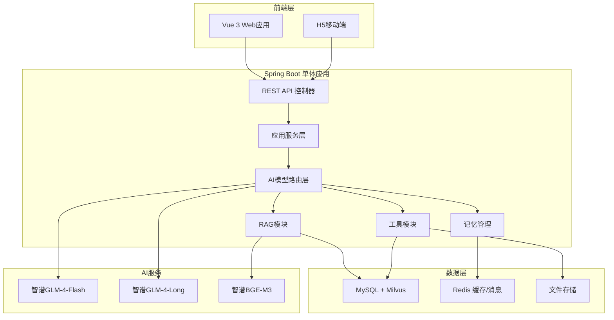

# 律法通APP - Java+AI法律咨询平台开发方案

## 一、项目概述

本项目旨在构建"律法通APP"，一个基于Java和AI技术的智能化法律咨询平台，为用户提供专业、准确的法律咨询服务。APP将整合智谱系列AI模型的强大能力，结合法律知识库，实现智能法律问答、合同分析、案例检索等核心功能，为个人用户和企业用户提供便捷、高效的法律服务。

### 1.1 项目目标
- 提供专业、准确的法律咨询服务
- 实现合同智能分析与风险评估
- 构建法律知识库，支持快速检索和参考
- 提供律师匹配与预约服务
- 确保系统安全、稳定、高效运行

### 1.2 应用场景
- **个人用户**：日常法律问题咨询、合同审查、权益保障
- **企业用户**：企业法律咨询、合同起草、劳动纠纷处理
- **律师**：案例参考、法律条文检索、辅助办案
- **法律教育**：法律知识学习、案例分析、模拟训练

## 二、技术选型

### 2.1 核心技术栈

#### Phase 1（MVP）技术栈

| 技术 | 版本 | 用途 | 配置要点 |
|------|------|------|----------|
| **Java** | 17 | 核心编程语言 | LTS版本，稳定可靠 |
| **Spring Boot** | 3.2.x | 应用框架 | 单体架构，模块化包结构 |
| **智谱Java SDK** | 最新版 | AI模型调用 | 直接调用智谱API，稳定可控 |
| **MySQL** | 8.0 | 关系型数据库 | 配置UTF-8编码，FULLTEXT全文检索 |
| **Milvus** | 2.4.x | 向量数据库 | HNSW索引，开发用Milvus Lite嵌入式 |
| **Redis** | 7.0+ | 缓存和消息队列 | 配置Redis Stream用于异步任务 |
| **Vue** | 3.4.0 | 前端框架 | 启用Composition API和TypeScript |
| **Vite** | 5.0.0 | 前端构建工具 | 配置热更新和生产优化 |
| **TypeScript** | 5.3.0 | 前端类型系统 | 配置严格类型检查 |
| **Axios** | 1.6.0 | HTTP客户端 | 配置拦截器和错误处理 |
| **Element Plus** | 2.4.0 | UI组件库 | 配置主题和国际化 |
| **PDFBox** | 3.0.0 | PDF处理 | 用于合同文档解析 |
| **Apache POI** | 5.2.0 | Office文档处理 | 用于Word文档解析 |
| **SpringDoc** | 2.3.0 | API文档 | 配置OpenAPI 3.0规范，替代旧版Swagger |
| **Docker Compose** | 24.0+ | 容器化部署 | 单机容器编排，开发/生产统一 |

#### Phase 2/3 扩展技术栈（按需引入）

| 技术 | 版本 | 引入阶段 | 用途 |
|------|------|---------|------|
| **Elasticsearch** | 8.x | Phase 2 | 全文检索，混合检索增强 |
| **Neo4j** | 5.x | Phase 3 | 知识图谱，法律概念关系 |
| **RabbitMQ** | 3.x | Phase 2 | 异步任务（如Redis Stream不满足时） |
| **Kubernetes** | 1.28+ | Phase 3 | 容器编排，规模化部署 |
| **Spring AI** | 稳定版 | Phase 2 | AI模型统一抽象层（待稳定版发布） |

### 2.2 AI模型选择与配置

> **注意**：以下模型名称和版本需在开发前与智谱官方API文档确认，确保模型可用且定价合理。

| 模型 | 用途 | 配置参数 | 引入阶段 |
|------|------|----------|----------|
| **智谱GLM-4-Flash** | 通用法律问答，响应快成本低 | temperature=0.7, top_p=0.9, max_tokens=4096 | Phase 1 |
| **智谱GLM-4-Long** | 超长上下文，合同分析 | temperature=0.5, top_p=0.8, max_tokens=16384 | Phase 1 |
| **智谱BGE-M3** | Embedding模型，向量检索 | dimension=1024, batch_size=32 | Phase 1 |
| **智谱GLM-4-Plus** | 法律领域深度推理（如可用） | temperature=0.6, top_p=0.85, max_tokens=8192 | Phase 2 |

#### 模型路由策略
- **法律问答** → GLM-4-Flash（快速响应）
- **合同分析** → GLM-4-Long（长上下文）
- **深度推理** → GLM-4-Plus（高质量）
- **降级策略**：主模型不可用时降级到Flash模型，并提示用户响应质量可能降低

### 2.3 智谱模型优势
- **法律条文理解准确**：能够准确理解中国法律条文的具体含义和适用场景
- **案例匹配精准**：基于案件事实描述，能够快速找到相似判例和参考案例
- **推理逻辑清晰**：能够按照"事实-法律适用-结论"的逻辑链条进行分析
- **超长上下文处理**：GLM-4-Long支持超长上下文，可处理完整合同文档
- **多轮对话能力**：支持连续对话，保持上下文一致性
- **Function Call能力**：支持调用外部工具，实现复杂任务处理
- **流式输出**：支持实时流式响应，提升用户体验
- **成本优势**：Flash模型调用成本低，适合高频问答场景

## 三、系统架构

### 3.1 整体架构

#### Phase 1 架构：单体模块化

#### Phase 3 架构：微服务化（远期目标）

当用户量和业务复杂度增长后，按业务边界拆分为微服务：
- legal-api：API网关服务
- legal-core：核心业务服务
- legal-ai：AI模型服务
- legal-storage：存储服务
- 服务通信：RESTful API → gRPC（按需）
- 服务发现：K8s Service
- 配置管理：K8s ConfigMap/Secret

### 3.2 核心组件详细设计

| 组件 | 职责 | 技术实现 | 关键类/接口 |
|------|------|----------|------------|
| **前端层** | 用户界面交互 | Vue 3 + TypeScript | App.vue, LegalConsultation.vue, ContractAnalysis.vue |
| **控制器层** | 请求处理与路由 | Spring Web | LegalController, ContractController |
| **应用服务层** | 业务逻辑实现 | Spring Service | LegalService, ContractService |
| **AI模型路由层** | 模型选择与降级 | 智谱SDK + 自定义路由 | ModelRouterService, ChatService, EmbeddingService |
| **RAG模块** | 检索增强生成 | Milvus + 自定义检索 | LegalRAGService, DocumentRetriever, VectorStoreService |
| **工具模块** | 专业工具集成 | 自定义工具 | ContractAnalyzer, CaseRetriever |
| **记忆管理** | 对话上下文维护 | Redis + 自定义缓存 | ChatMemoryService, SessionManager |
| **数据层** | 数据存储与检索 | MySQL + Milvus + Redis | LegalRepository, VectorRepository, CacheRepository |

## 四、知识库设计构建理念

### 4.1 知识库架构

法律知识库是律法通APP的核心基础，采用多层次、多维度的设计理念，确保知识的准确性、完整性和可访问性：

#### 4.1.1 知识层次结构

| 层次 | 内容 | 来源 | 更新频率 |
|------|------|------|----------|
| **法律条文层** | 国家法律法规、司法解释、部门规章 | 官方网站、法律法规数据库 | 每日同步 |
| **案例层** | 各级法院判例、典型案例、指导案例 | 法院网站、案例数据库 | 每日更新 |
| **合同模板层** | 各类合同模板、格式条款、示范文本 | 律师协会、法律出版社 | 每周更新 |
| **法律知识层** | 法律概念、法律原则、法律解释 | 法律教材、学术论文 | 每月更新 |
| **实务指南层** | 法律实务操作指南、办事流程、常见问题 | 律师实务经验、官方指南 | 每月更新 |

#### 4.1.2 知识组织方式

| 知识类型 | 组织方式 | 技术实现 | 引入阶段 |
|---------|---------|----------|----------|
| **半结构化知识** | 标签体系 + 关系数据库 | MySQL标签字段 | Phase 1 |
| **非结构化知识** | 向量存储 | Milvus | Phase 1 |
| **结构化知识** | 知识图谱 | Neo4j | Phase 3 |
| **全文索引** | 倒排索引 | Elasticsearch | Phase 2 |

### 4.2 知识库构建流程

#### 4.2.1 数据采集

> **合规提示**：数据采集需确认数据授权，优先使用官方开放API和已授权数据源，避免违反网站服务条款。

| 数据类型 | 采集方式 | 工具 | 频率 | 数据源 |
|---------|---------|------|------|--------|
| **法律条文** | 官方API、开放数据集 | RestTemplate、定时任务 | 每日同步 | 国家法律法规数据库API、北大法宝开放数据 |
| **案例数据** | 官方API、数据库同步 | JDBC、RestTemplate | 每日同步 | 中国裁判文书网开放接口 |
| **合同模板** | 文件上传、人工录入 | Spring文件上传 | 每周更新 | 律师协会示范文本 |
| **法律知识** | 数据库同步、文件解析 | Apache POI、PDFBox | 每月更新 | 法律出版社授权内容 |

#### 4.2.2 数据处理

| 处理步骤 | 技术实现 | 工具 | 输出 |
|---------|---------|------|------|
| **文本清洗** | 正则表达式、规则引擎 | Java自定义工具 | 清洗后的文本 |
| **信息提取** | 智谱API提取关键实体 | GLM-4-Flash Function Call | 结构化信息 |
| **知识标注** | 规则引擎 + 人工标注 | 自定义规则 + 后台管理界面 | 标注后的知识 |
| **质量控制** | 人工审核、自动校验 | 自定义审核系统 | 高质量知识 |

#### 4.2.3 向量化存储

| 步骤 | 技术实现 | 配置 | 性能指标 |
|------|---------|------|----------|
| **文本分块** | 语义分块算法 | 块大小：512tokens，重叠：128tokens | 分块准确率 > 95% |
| **Embedding生成** | 智谱BGE-M3模型 | batch_size=32，并发数=8 | 生成速度：1000tokens/秒 |
| **向量存储** | Milvus | 向量维度：1024，索引类型：HNSW | 查询延迟 < 10ms |
| **索引构建** | Milvus索引 | 索引参数：M=16, efConstruction=256 | 检索准确率 > 90% |

#### 4.2.4 知识更新机制

| 更新类型 | 触发方式 | 处理流程 | 监控指标 |
|---------|---------|---------|----------|
| **定期更新** | 定时任务 | 全量采集 → 处理 → 存储 | 更新覆盖率 > 99% |
| **增量更新** | 事件触发 | 增量采集 → 处理 → 存储 | 响应时间 < 5分钟 |
| **版本管理** | 事务管理 | 版本记录 → 历史存储 → 回溯支持 | 版本一致性 100% |

### 4.3 知识库检索策略

#### 4.3.1 多模态检索

| 检索类型 | 技术实现 | 适用场景 | 引入阶段 |
|---------|---------|---------|----------|
| **向量检索** | Milvus相似度搜索 | 语义理解、模糊匹配 | Phase 1 |
| **关键词检索** | MySQL FULLTEXT全文搜索 | 关键词查询、精确匹配 | Phase 1 |
| **混合检索** | 加权融合算法 | 综合查询、复杂问题 | Phase 1 |
| **全文检索** | Elasticsearch | 高级全文搜索、聚合分析 | Phase 2 |

#### 4.3.2 检索优化

| 优化策略 | 技术实现 | 效果 | 实现难度 |
|---------|---------|------|----------|
| **查询扩展** | 同义词词典、Word2Vec | 召回率提升 20% | 中 |
| **相关性排序** | BM25算法、向量相似度 | 准确率提升 15% | 中 |
| **上下文感知** | 对话历史嵌入、注意力机制 | 相关性提升 25% | 高 |
| **个性化检索** | 用户画像、历史行为分析 | 满意度提升 30% | 高 |
| **结果重排** | 机器学习排序模型 | 相关性提升 10% | 中 |

### 4.4 知识库评估与改进

#### 4.4.1 评估指标

| 指标 | 定义 | 计算方法 | 目标值 |
|------|------|----------|--------|
| **准确性** | 检索结果的正确程度 | 正确结果数 / 总结果数 | > 90% |
| **相关性** | 检索结果与查询的相关程度 | 相关结果数 / 总结果数 | > 85% |
| **覆盖度** | 知识库对法律领域的覆盖程度 | 已覆盖知识点 / 总知识点 | > 95% |
| **时效性** | 知识的更新及时程度 | 最新知识占比 | > 98% |
| **响应时间** | 检索响应的速度 | 平均检索时间 | < 200ms |
| **用户满意度** | 用户对检索结果的满意程度 | 满意用户数 / 总用户数 | > 90% |

#### 4.4.2 改进机制

| 改进策略 | 实施方式 | 频率 | 预期效果 |
|---------|---------|------|----------|
| **用户反馈收集** | 反馈表单、评分系统 | 实时 | 问题发现率提升 30% |
| **自动评估** | 定期运行评估脚本 | 每周 | 问题发现率提升 25% |
| **专家审核** | 法律专家定期审核 | 每月 | 准确性提升 15% |
| **持续优化** | 基于评估结果调整 | 持续 | 整体性能提升 20% |
| **A/B测试** | 对比不同检索策略 | 季度 | 最优策略选择 |

## 五、核心功能模块

### 5.1 智能法律咨询

| 功能 | 技术实现 | 流程 | 性能指标 | 阶段 |
|------|---------|------|----------|------|
| **自然语言问答** | 智谱GLM-4-Flash + RAG | 用户提问 → 意图识别 → 知识检索 → 回答生成 | 首token < 1秒，流式输出 | Phase 1 |
| **法律条文检索** | Milvus + MySQL全文搜索 | 关键词提取 → 向量检索 → 结果融合 | 检索时间 < 500ms | Phase 1 |
| **多轮对话** | Redis + 对话历史管理 | 会话管理 → 上下文维护 → 意图理解 → 连续对话 | 上下文准确率 > 90% | Phase 1 |
| **免责声明** | 模板引擎 | 自动添加 → 格式适配 → 显示 | 合规率 100% | Phase 1 |
| **法律意见生成** | 智谱GLM-4-Plus | 问题分析 → 法律适用 → 意见生成 → 格式优化 | 意见质量评分 > 80% | Phase 2 |
| **法条引用** | 规则引擎 + 知识库 | 法条识别 → 来源验证 → 格式规范 → 引用插入 | 引用准确率 > 85% | Phase 2 |

### 5.2 合同分析

| 功能 | 技术实现 | 流程 | 性能指标 | 阶段 |
|------|---------|------|----------|------|
| **合同上传** | 文件上传服务 + 存储 | 文件上传 → 格式验证 → 存储 → 解析准备 | 上传速度 < 10秒/MB | Phase 1 |
| **条款分析** | 智谱GLM-4-Long | 文档解析 → 条款提取 → 语义理解 → 风险识别 | 分析时间 < 60秒/份 | Phase 1 |
| **风险评估** | 规则引擎 + AI识别 | 风险识别 → 等级评估 → 风险分类 → 预警生成 | 风险识别准确率 > 70% | Phase 1 |
| **修改建议** | 智谱GLM-4-Flash | 问题分析 → 法律依据 → 建议生成 → 格式优化 | 建议质量评分 > 75% | Phase 2 |
| **合同对比** | 文本差异算法 | 文档解析 → 结构对齐 → 差异识别 → 可视化展示 | 对比时间 < 15秒/份 | Phase 2 |

### 5.3 案例检索与分析

| 功能 | 技术实现 | 流程 | 性能指标 | 阶段 |
|------|---------|------|----------|------|
| **案例搜索** | Milvus + MySQL全文搜索 | 查询解析 → 关键词提取 → 向量检索 → 结果排序 | 搜索时间 < 1秒 | Phase 2 |
| **案例分析** | 智谱GLM-4-Flash | 案例解析 → 要点提取 → 法律分析 → 结论生成 | 分析时间 < 15秒/案例 | Phase 2 |
| **类案推送** | 相似度算法 + 推荐系统 | 用户问题分析 → 案例匹配 → 相似度排序 → 推送 | 推送相关性 > 80% | Phase 2 |
| **案例可视化** | ECharts + 数据处理 | 数据提取 → 统计分析 → 图表生成 → 交互展示 | 渲染时间 < 2秒 | Phase 2 |

### 5.4 律师匹配与预约

| 功能 | 技术实现 | 流程 | 性能指标 | 阶段 |
|------|---------|------|----------|------|
| **智能匹配** | 标签匹配 + AI推荐 | 用户需求分析 → 律师画像 → 匹配算法 → 结果排序 | 匹配时间 < 500ms | Phase 2 |
| **在线预约** | 日历系统 + Redis消息 | 预约请求 → 时间冲突检查 → 确认 → 通知 | 预约处理时间 < 2秒 | Phase 2 |
| **律师推荐** | 协同过滤 + 内容推荐 | 历史数据分析 → 偏好学习 → 推荐生成 → 结果优化 | 推荐准确率 > 75% | Phase 3 |
| **咨询管理** | 工作流引擎 + 数据库 | 预约管理 → 进度跟踪 → 文档管理 → 历史记录 | 管理操作响应 < 1秒 | Phase 3 |
| **评价系统** | 评分算法 + 情感分析 | 评价收集 → 情感分析 → 评分计算 → 反馈处理 | 评价处理时间 < 1秒 | Phase 3 |

### 5.5 法律知识库

| 功能 | 技术实现 | 流程 | 性能指标 | 阶段 |
|------|---------|------|----------|------|
| **法律条文查询** | Milvus + 关系数据库 | 查询解析 → 向量检索 → 结果过滤 → 展示 | 查询时间 < 500ms | Phase 1 |
| **常见问题** | 问答系统 + 意图识别 | 问题匹配 → 答案检索 → 上下文适配 → 回答 | 响应时间 < 500ms | Phase 1 |
| **实务指南** | 文档管理 + 内容检索 | 指南分类 → 内容索引 → 检索 → 展示 | 检索时间 < 300ms | Phase 2 |
| **法律概念解释** | AI生成 + 知识库参考 | 概念识别 → 知识检索 → 解释生成 → 格式优化 | 解释生成时间 < 2秒 | Phase 2 |
| **法律资讯** | 内容管理 + 推送系统 | 资讯采集 → 分类 → 个性化推荐 → 推送 | 推送准确率 > 75% | Phase 3 |

## 六、技术实现细节

### 6.1 RAG实现

#### 6.1.1 文档分块
- **分块算法**：基于语义的递归分块算法
- **分块参数**：块大小512tokens，重叠128tokens
- **分块策略**：优先按段落、章节分割，确保语义完整性
- **实现工具**：LangChain4j分块器 + 自定义语义分块逻辑

#### 6.1.2 Embedding生成
- **模型选择**：智谱BGE-M3
- **向量维度**：1024维
- **批处理**：批量大小32，并发数8
- **缓存策略**：Redis缓存已生成的embedding，避免重复计算

#### 6.1.3 向量存储
- **存储引擎**：Milvus（开发用Milvus Lite嵌入式，生产用Milvus Standalone）
- **索引类型**：HNSW索引，M=16，efConstruction=256
- **查询参数**：相似度阈值0.7，返回Top 5结果
- **优化策略**：定期重建索引，优化查询性能

#### 6.1.4 检索策略
- **Phase 1检索**：MySQL FULLTEXT全文检索 + Milvus向量相似度检索
- **权重分配**：文本检索权重0.4，向量检索权重0.6
- **结果融合**：基于分数加权融合（RRF算法），排序后返回
- **上下文构建**：将检索结果按相关性排序，构建最大长度4096tokens的上下文
- **Phase 2增强**：引入Elasticsearch，支持更复杂的全文检索和聚合分析

### 6.2 智谱模型集成

#### 6.2.1 API接入
- **接入方式**：智谱开放平台REST API（通过智谱官方Java SDK或HTTP客户端）
- **认证方式**：API Key + 签名验证
- **请求格式**：JSON格式，支持流式和非流式请求
- **错误处理**：指数退避重试机制，处理API限流和超时
- **模型路由**：ModelRouterService根据任务类型选择模型，主模型不可用时降级到Flash模型

#### 6.2.2 参数优化
- **通用问答参数**（GLM-4-Flash）：temperature=0.7，top_p=0.9，max_tokens=4096
- **合同分析参数**（GLM-4-Long）：temperature=0.5，top_p=0.8，max_tokens=16384
- **深度推理参数**（GLM-4-Plus，Phase 2）：temperature=0.6，top_p=0.85，max_tokens=8192
- **参数调优**：基于A/B测试持续优化参数组合

#### 6.2.3 流式输出
- **实现方式**：Server-Sent Events (SSE)
- **前端处理**：Vue 3 + EventSource API
- **后端实现**：Spring MVC SseEmitter（Phase 1），可按需升级WebFlux
- **用户体验**：模拟打字机效果，提升交互体验

#### 6.2.4 Function Call
- **工具定义**：基于智谱Function Call规范定义工具
- **工具注册**：动态注册和管理工具
- **调用流程**：模型生成调用请求 → 执行工具 → 返回结果给模型
- **错误处理**：工具调用失败时的重试和降级策略

#### 6.2.5 多轮对话
- **会话管理**：基于Redis的会话存储
- **上下文维护**：滑动窗口机制，保持最近10轮对话
- **会话超时**：30分钟无活动自动超时
- **内存优化**：定期清理过期会话，节省内存

### 6.3 合同分析实现

#### 6.3.1 文档解析
- **PDF解析**：PDFBox（Phase 1），OCR支持按需引入
- **Word解析**：Apache POI
- **格式转换**：统一转换为纯文本和结构化数据
- **性能优化**：大文档分块解析，避免内存溢出

#### 6.3.2 条款提取
- **NLP技术**：基于规则的条款识别 + 智谱API辅助提取
- **命名实体识别**：通过智谱Function Call识别合同中的关键实体（如金额、日期、当事人）
- **关系抽取**：提取条款间的逻辑关系
- **实现工具**：自定义规则引擎 + 智谱GLM-4-Flash API

#### 6.3.3 风险识别
- **规则引擎**：基于法律专家知识的规则系统（Phase 1核心）
- **AI辅助识别**：通过智谱API识别常见风险条款（Phase 1）
- **风险等级**：低、中、高三级风险评估
- **风险分类**：条款缺陷、法律适用错误、表述歧义等

#### 6.3.4 建议生成
- **生成模型**：智谱GLM-4-Flash
- **法律依据**：基于知识库检索相关法条和案例
- **建议格式**：结构化建议，包含问题描述、法律依据、修改建议
- **质量控制**：人工审核 + 自动评估

#### 6.3.5 可视化展示
- **前端实现**：Vue 3 + Element Plus + ECharts
- **高亮标注**：风险条款红色高亮，修改建议绿色标注
- **交互式展示**：支持条款展开/折叠，建议查看/隐藏
- **导出功能**：支持导出分析报告为PDF和Word

### 6.4 系统安全

#### 6.4.1 数据加密
- **传输加密**：HTTPS + TLS 1.3
- **存储加密**：AES-256加密敏感数据
- **密钥管理**：使用密钥管理服务，定期轮换密钥
- **加密范围**：用户个人信息、律师信息、合同内容等敏感数据

#### 6.4.2 访问控制
- **认证方式**：JWT + OAuth 2.0
- **授权机制**：基于角色的访问控制（RBAC）
- **权限管理**：细粒度权限控制，最小权限原则
- **会话管理**：会话超时、并发控制

#### 6.4.3 隐私保护
- **数据脱敏**：敏感信息脱敏处理
- **数据最小化**：仅收集必要数据
- **用户同意**：明确的用户同意机制
- **合规性**：符合《中华人民共和国个人信息保护法》、《数据安全法》等相关法规；服务海外用户时考虑GDPR/CCPA

#### 6.4.4 审计日志
- **日志记录**：全系统操作日志，包括用户行为、系统事件
- **日志存储**：Phase 1使用文件日志 + 数据库存储；Phase 2引入ELK Stack集中分析
- **日志保留**：关键日志保留3年以上
- **审计功能**：支持按用户、操作、时间等维度审计

#### 6.4.5 漏洞防护
- **安全扫描**：定期进行漏洞扫描和渗透测试
- **依赖管理**：定期更新依赖库，修复已知漏洞
- **WAF**：部署Web应用防火墙，防御常见攻击
- **安全响应**：建立安全事件响应机制，及时处理安全漏洞

## 七、部署与维护

### 7.1 部署架构

#### 7.1.1 Phase 1：Docker Compose单体部署
- **容器技术**：Docker + Docker Compose
- **服务编排**：
  - lvatong-app：Spring Boot应用
  - mysql：MySQL 8.0
  - redis：Redis缓存/消息
  - nginx：反向代理 + 静态资源
- **镜像构建**：多阶段构建，减小镜像体积
- **环境隔离**：开发、测试、生产环境使用不同docker-compose配置
- **配置管理**：环境变量 + application.yml profile机制

#### 7.1.2 Phase 3：K8s微服务部署（远期目标）
- **服务拆分**：按业务边界拆分为微服务
- **服务通信**：RESTful API → gRPC（按需）
- **服务发现**：K8s Service
- **配置管理**：K8s ConfigMap/Secret
- **负载均衡**：K8s Ingress + Nginx Ingress Controller
- **自动扩缩容**：HPA基于CPU/内存指标

#### 7.1.3 高可用与灾备
- **Phase 1**：单机部署 + 数据库定期备份，RTO < 4小时
- **Phase 2**：主从数据库 + Nginx负载均衡，RTO < 1小时
- **Phase 3**：多副本部署 + 跨区域灾备，RTO < 15分钟

### 7.2 监控与维护

#### 7.2.1 系统监控
- **监控工具**：Prometheus + Grafana
- **监控指标**：
  - 系统指标：CPU、内存、磁盘、网络
  - 应用指标：请求量、响应时间、错误率
  - AI服务指标：模型调用次数、响应时间、成功率
- **监控面板**：自定义Grafana面板，实时监控系统状态

#### 7.2.2 日志管理
- **Phase 1**：Spring Boot Logback + 文件日志，结构化JSON格式
- **Phase 2**：引入ELK Stack（Elasticsearch + Logstash + Kibana）集中分析
- **日志级别**：DEBUG、INFO、WARN、ERROR
- **日志保留**：热数据7天，冷数据30天

#### 7.2.3 告警机制
- **告警工具**：Alertmanager + 企业微信/邮件通知
- **告警规则**：
  - 系统告警：CPU > 80%、内存 > 90%、磁盘 > 95%
  - 应用告警：错误率 > 5%、响应时间 > 5秒
  - AI服务告警：模型调用失败率 > 10%
- **告警级别**：紧急、重要、一般
- **告警处理**：自动创建工单，通知相关人员

#### 7.2.4 数据备份与恢复
- **备份策略**：
  - 数据库：每日全量备份，每小时增量备份
  - 文件存储：每日备份，异地存储
  - 配置数据：每次变更后备份
- **备份存储**：本地存储 + 云存储（AWS S3/阿里云OSS）
- **恢复测试**：每月进行一次恢复测试，确保备份可用性
- **恢复时间目标**：RTO < 4小时，RPO < 15分钟

#### 7.2.5 版本管理与发布
- **版本控制**：Git + GitFlow工作流
- **持续集成**：GitHub Actions
- **持续部署**：Phase 1手动部署 → Phase 2 CI/CD自动部署
- **发布策略**：Phase 1滚动更新 → Phase 3蓝绿部署/金丝雀发布
- **回滚机制**：Docker镜像版本管理，快速回滚到上一个稳定版本

### 7.3 性能优化

#### 7.3.1 缓存策略
- **缓存层级**：
  - 本地缓存：Caffeine
  - 分布式缓存：Redis
- **缓存策略**：
  - 热点数据：永久缓存，定期更新
  - 中频数据：TTL 1小时
  - 低频数据：TTL 24小时
- **缓存失效**：主动失效 + 被动失效
- **缓存一致性**：使用消息队列保证缓存与数据库一致性

#### 7.3.2 异步处理
- **消息队列**：Redis Stream（Phase 1），可按需引入RabbitMQ（Phase 2）
- **异步任务**：
  - 文档解析：异步解析大文档
  - 向量化：异步生成向量
  - 报告生成：异步生成分析报告
- **任务调度**：Spring Scheduler
- **任务监控**：实时监控任务执行状态

#### 7.3.3 数据库优化
- **查询优化**：
  - 索引优化：为频繁查询的字段创建索引
  - 查询计划：分析执行计划，优化慢查询
  - 连接池：使用HikariCP连接池，优化连接管理
- **存储优化**：
  - 分区表：按时间分区，提高查询性能（Phase 2）
  - 读写分离：主库写，从库读（Phase 2）
  - 分库分表：水平分库分表，应对数据增长（Phase 3）

#### 7.3.4 AI模型优化
- **模型路由**：根据任务类型选择合适的模型，降低成本
- **结果缓存**：缓存模型推理结果，避免重复计算
- **批量处理**：合并相似请求，减少API调用次数
- **Prompt优化**：优化提示词模板，提高输出质量和一致性
- **降级策略**：主模型不可用时自动降级到备用模型

#### 7.3.5 代码优化
- **算法优化**：选择高效的算法和数据结构
- **并行处理**：使用Java线程池和CompletableFuture
- **资源管理**：合理使用连接池、线程池
- **代码审查**：定期代码审查，发现并修复性能问题
- **性能测试**：使用JMeter进行负载测试，找出性能瓶颈

## 八、项目实施计划

### 8.1 Phase 1 - MVP（12-14周）

#### 8.1.1 需求分析与设计（2周）
- **任务**：
  - 与法务专家和潜在用户进行需求访谈
  - 确认智谱API可用模型和定价
  - 确认法律数据源授权
  - 设计数据库结构和API接口
  - 制定开发规范
- **交付物**：
  - 需求规格说明书（含合规分析）
  - 数据库设计文档
  - API接口设计文档

#### 8.1.2 基础设施搭建（2周）
- **任务**：
  - 搭建Spring Boot项目骨架
  - 配置MySQL + Milvus
  - 配置Redis
  - 实现用户认证（JWT）
  - 集成智谱API
  - 搭建Vue 3前端项目
- **交付物**：
  - 可运行的项目骨架
  - Docker Compose开发环境

#### 8.1.3 核心功能开发（6-8周）
- **任务**：
  - 智能法律问答（RAG + GLM-4-Flash）
  - 多轮对话管理
  - 法律条文查询（Milvus检索）
  - 合同上传与基础分析（GLM-4-Long）
  - 风险提示（规则引擎 + AI）
  - 知识库初始数据导入
  - 前端界面开发
- **交付物**：
  - MVP功能代码
  - 单元测试报告

#### 8.1.4 测试与上线（2周）
- **任务**：
  - 功能测试与Bug修复
  - 性能基线测试
  - 安全基线检查
  - Docker Compose生产环境部署
  - 内测用户邀请
- **交付物**：
  - 测试报告
  - 部署文档
  - MVP上线

### 8.2 Phase 2 - 功能增强（8-10周）

- **案例检索与分析**：Elasticsearch全文检索 + Milvus混合检索
- **合同分析增强**：修改建议、合同对比
- **律师匹配与预约**：标签匹配 + AI推荐
- **法律意见生成**：GLM-4-Plus深度推理
- **知识库扩充**：更多法律领域数据
- **性能优化**：缓存策略、异步处理
- **监控体系**：Prometheus + Grafana + ELK

### 8.3 Phase 3 - 规模化（持续）

- **微服务拆分**：按业务边界拆分，K8s部署
- **知识图谱**：Neo4j法律概念关系
- **高级功能**：法律文书生成、风险评估
- **移动端原生APP**
- **律师生态**：协同过滤推荐、评价系统
- **国际化**：多语言支持

### 8.4 项目里程碑

| 里程碑 | 时间点 | 关键交付物 |
|--------|--------|------------|
| Phase 1 设计完成 | 第2周末 | 需求与设计文档 |
| Phase 1 基础设施就绪 | 第4周末 | 可运行项目骨架 |
| Phase 1 核心功能完成 | 第10周末 | MVP功能代码 |
| Phase 1 MVP上线 | 第14周末 | 上线报告 |
| Phase 2 功能增强完成 | 第24周末 | 增强版上线 |
| Phase 3 规模化启动 | 第25周起 | 微服务架构上线 |

## 九、预期效果

### 9.1 技术效果

| 指标 | Phase 1目标 | Phase 2/3目标 | 实现方式 | 测量方法 |
|------|------------|--------------|----------|----------|
| **响应速度** | 首token < 1秒，流式输出 | P95 < 3秒 | 优化RAG检索、缓存策略 | 负载测试，监控P95 |
| **准确率** | 法律问答准确率 > 75% | > 90% | 优化RAG策略、模型调优 | 人工评估 + 自动评估 |
| **系统可用性** | > 99% | > 99.9% | 单机部署+备份 → 多副本+故障转移 | 监控运行时间 |
| **并发处理** | 100并发 | 1000+并发 | 单体 → 水平扩展 | 负载测试 |
| **数据安全** | 数据泄露事件为0 | 数据泄露事件为0 | 加密、访问控制、审计 | 安全测试 |

### 9.2 业务效果

| 指标 | Phase 1目标 | Phase 2/3目标 | 测量方法 |
|------|------------|--------------|----------|
| **用户满意度** | > 80% | > 95% | 用户调研、满意度调查 |
| **服务效率** | 咨询效率提升 > 30% | > 50% | 对比人工服务时间 |
| **成本降低** | 法律服务成本降低 > 20% | > 30% | 对比传统法律服务成本 |
| **业务覆盖** | 覆盖3-5个法律领域 | 覆盖10+法律领域 | 功能覆盖分析 |
| **律师参与** | 签约律师 > 50名 | > 1000名 | 律师注册数量 |

## 十、总结

本方案基于Java和智谱AI技术，采用**分阶段实施**策略构建"律法通APP"。Phase 1聚焦核心功能（法律问答+合同分析），以单体架构快速验证产品价值；Phase 2/3逐步扩展功能和架构，最终实现完整的智能化法律咨询平台。

### 核心优势

1. **渐进式架构**：Phase 1单体架构快速交付，按需演进到微服务，避免过度设计
2. **技术务实**：直接调用智谱API而非依赖不稳定的Spring AI预览版，确保可控性
3. **专业知识**：构建多层次法律知识库，确保回答的准确性和专业性
4. **用户体验**：流式输出、多轮对话、免责声明自动附加，兼顾体验与合规
5. **安全合规**：符合中国《个人信息保护法》《数据安全法》，明确AI法律意见的责任边界

### 合规与风险提示

1. **平台定位**："法律信息工具"而非"法律服务提供者"，每条AI回复必须附加免责声明
2. **律师法合规**：AI咨询不构成有偿法律服务，需法律顾问论证平台定位
3. **数据授权**：法律数据源需确认授权，优先使用官方开放API
4. **成本控制**：智谱API调用费用需持续监控，Flash模型用于高频场景控制成本

### 应用价值

1. **提升法律服务效率**：通过AI技术，大幅提升法律咨询和合同分析的效率
2. **降低法律服务成本**：减少人工干预，降低法律服务的门槛和成本
3. **普及法律知识**：通过便捷的服务，让更多人能够获取专业的法律知识
4. **促进法律行业发展**：推动法律服务的数字化和智能化

### 未来展望

随着AI技术的不断发展和法律知识的不断更新，"律法通APP"将持续进化：

1. **功能扩展**：法律文书生成、法律风险评估、法律培训模拟
2. **模型优化**：持续优化Prompt和RAG策略，跟进智谱新模型
3. **生态建设**：构建法律生态系统，连接律师、用户和法律资源
4. **国际化**：拓展国际法律服务，支持多语言和跨国法律事务

"律法通APP"将成为法律服务行业的重要工具，为用户提供更加智能、专业、便捷的法律服务，推动法律服务行业的数字化转型和创新发展。